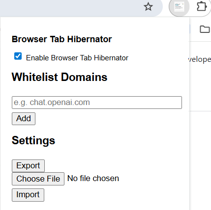
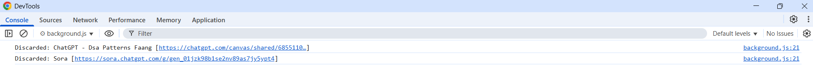

# Browser Tab Hibernator Extension(With UI for whitelisting tabs)

A lightweight Chrome/Brave/Edge extension that automatically discards inactive tabs to save memory — **with customisation to exclude specific tabs like Chatgpt/Gmail**.

## Features

- Automatically discards inactive, non-pinned tabs
- Whitelist domains with UI (never discarded):
  - `chatgpt.com`, `chat.openai.com`
  - `mail.google.com`
-  Remove from whitelist
-  Export/Import settings

- Works seamlessly in:
  - Google Chrome
  - Brave Browser
  - Microsoft Edge


 ## Installation (Manual / Unpacked)

1. Clone or download this repository:

   ```bash
   git clone https://github.com/Atsuya15/BrowserTabHibernator.git
   cd BrowserTabHibernator
   ```

2. Open your browser and visit:
   - **Chrome**: `chrome://extensions`
   - **Brave**: `brave://extensions`
   - **Edge**: `edge://extensions`

3. Enable **Developer Mode**
4. Click **“Load Unpacked”**
5. Select this folder

Your tabs will now automatically be discarded unless they are on the whitelist.

## Permissions

- **tabs**: Required to view tab metadata and discard them.
- **storage**: Required to store settings
- No content scripts. No page access. No tracking.

## How It Works

Every time you switch tabs:
- Inactive, non-pinned tabs are evaluated
- Tabs not on the whitelist are discarded using Chrome’s native `chrome.tabs.discard()` API

Use Chrome’s built-in Task Manager (`Shift+Esc`) to observe memory usage.
Also you can view discarded tabs on console by going to Extensions -> Manage extension -> Inspect views (service worker) -> Console

## Features

- Discards background tabs (saves RAM)
- Respects whitelist (ChatGPT, Gmail, etc.)
- Add/remove domains from popup
- Export/Import settings in JSON

##  Popup UI

Here’s what the Browser Tab Hibernator popup looks like when loaded:



##  Discarded Tabs in Console

You’ll see messages like this in the background console:



